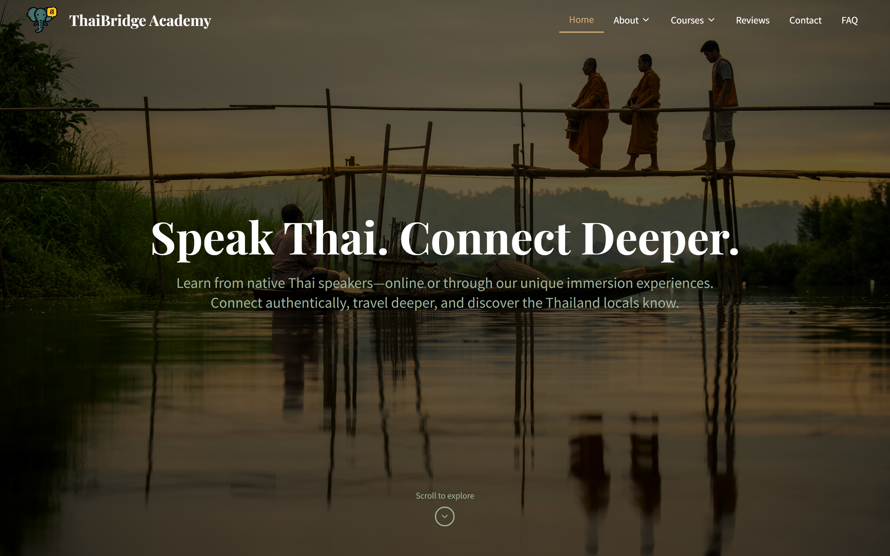
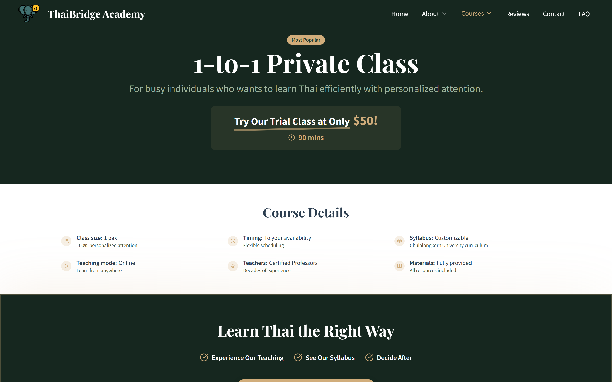
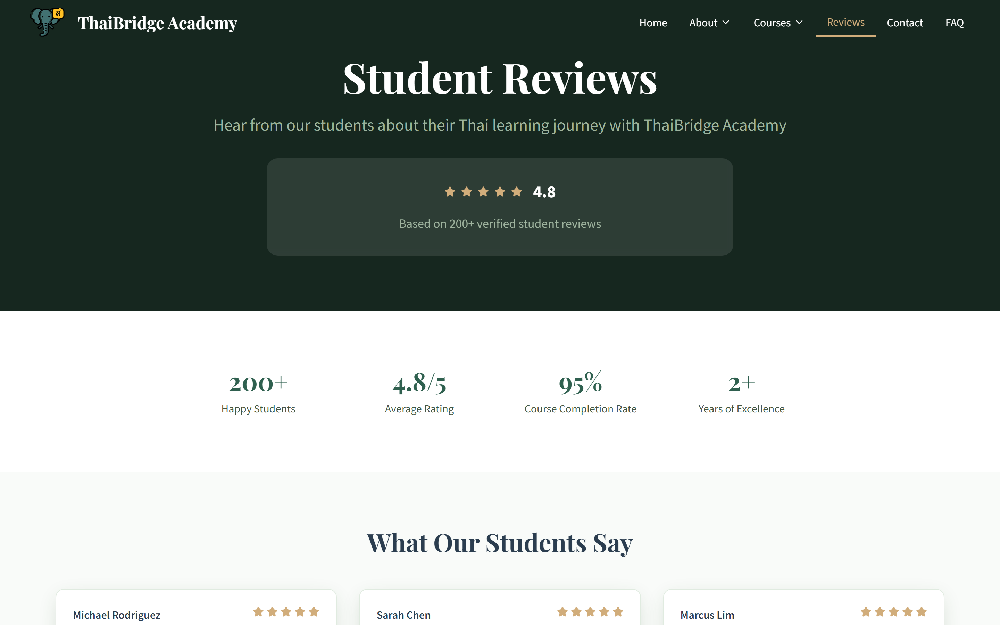
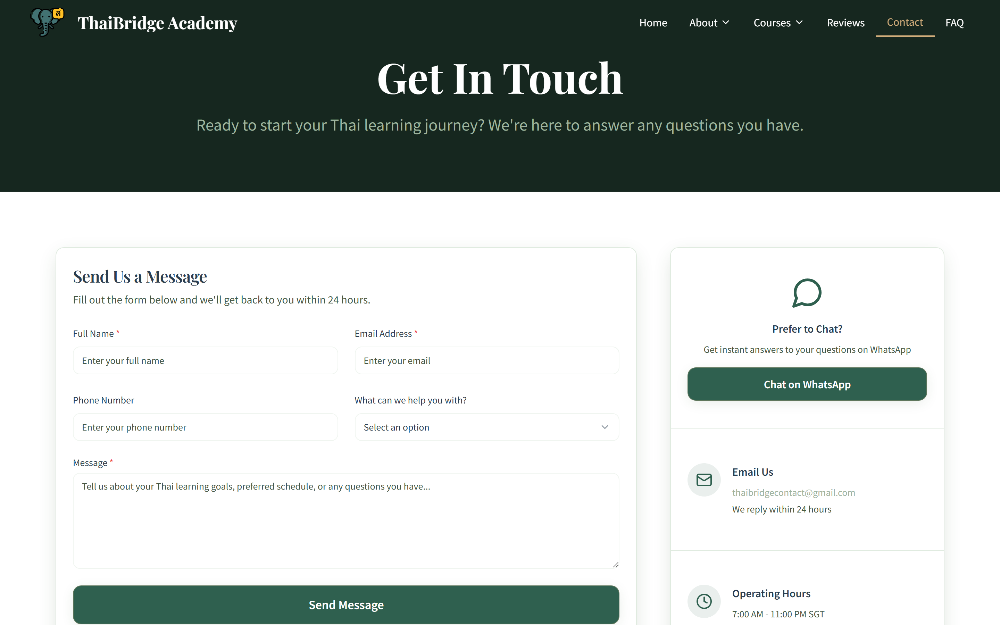
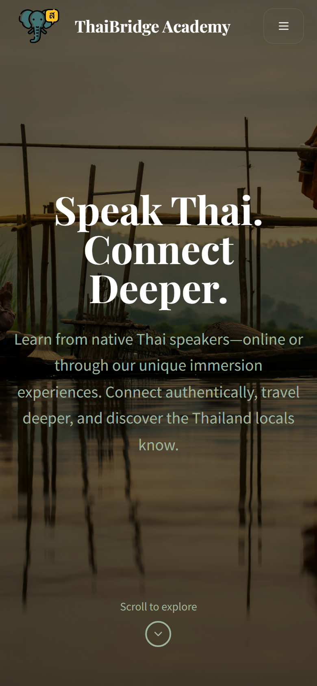

# ThaiBridge Academy

A full-stack web application for a Thai language school, offering course browsing, student reviews, contact management, and newsletter subscriptions. Built with a modern React frontend and a Python FastAPI backend.

**Live Site:** [https://www.thaibridge.academy](https://www.thaibridge.academy)

---

## Tech Stack

### Frontend
- **React 18** with **TypeScript** — component-based UI with type safety
- **Vite** — fast build tooling with HMR
- **Tailwind CSS** + **shadcn/ui** + **Radix UI** — utility-first styling with accessible, pre-built components
- **React Query (TanStack Query)** — server state management and caching
- **React Hook Form** + **Zod** — form handling with schema-based validation
- **React Router v6** — client-side routing
- **React Helmet Async** — SEO metadata management

### Backend
- **Python / FastAPI** — async REST API
- **Supabase (PostgreSQL)** — managed database with real-time capabilities
- **Pydantic v2** — request/response validation
- **Resend** — transactional email service
- **slowapi** — rate limiting per endpoint

### Infrastructure
- **Vercel** — frontend hosting
- **Render** — backend hosting
- **GitHub Actions** — CI pipeline (linting, security checks, health verification)

---

## Key Features

- **Course Catalog** — dedicated pages for Private Coaching, Corporate Training, Immersion Program, and Traveller's Pack, each with pricing, highlights, and testimonials
- **Student Reviews** — public review submission with star ratings, admin approval workflow, and aggregate statistics displayed on-site
- **Contact System** — inquiry form with auto-generated ticket IDs, async email notifications to both admin and customer, and inquiry categorization
- **Newsletter Subscriptions** — email signup with duplicate detection, welcome emails, and one-click unsubscribe via email link
- **Responsive Design** — mobile-first layout with a custom Thai-inspired color palette (forest greens, gold accents) and serif/sans-serif typography pairing
- **SEO Optimization** — Schema.org structured data, breadcrumb navigation, dynamic meta tags, and sitemap generation
- **Security Hardening** — rate limiting, XSS prevention, security headers (HSTS, CSP, X-Frame-Options), request size limits, and sanitized error responses
- **Feature Flags** — conditional feature rollout for upcoming offerings

---

## Architecture Overview

```
┌──────────────────┐         ┌──────────────────┐         ┌──────────────┐
│                  │  REST   │                  │         │              │
│  React Frontend  │ ──────► │  FastAPI Backend  │ ──────► │   Supabase   │
│  (Vercel)        │  JSON   │  (Render)        │  SQL    │  (PostgreSQL)│
│                  │ ◄────── │                  │ ◄────── │              │
└──────────────────┘         └────────┬─────────┘         └──────────────┘
                                      │
                                      │ Async
                                      ▼
                             ┌──────────────────┐
                             │  Email Service   │
                             │  (Resend)        │
                             └──────────────────┘
```

**Frontend** — A single-page React app handles routing, form validation, and UI rendering. It communicates with the backend via a centralized API client with retry logic and error mapping.

**Backend** — A FastAPI server exposes RESTful endpoints for contacts, subscriptions, and reviews. It validates all input with Pydantic, enforces rate limits per IP, and sends transactional emails asynchronously so API responses stay fast.

**Database** — Supabase (PostgreSQL) stores three main tables: subscribers, contact forms, and reviews. Reviews go through a pending → approved/rejected workflow before appearing publicly.

---

## My Role

I designed and built this application end-to-end as a solo developer:

- Architected the frontend and backend from scratch
- Designed the UI/UX with a custom Thai-inspired design system
- Implemented the full REST API with input validation, rate limiting, and security hardening
- Built the review moderation workflow and transactional email system
- Set up CI/CD pipelines, deployment infrastructure, and SEO optimization
- Wrote comprehensive API documentation and maintained clean, typed codebases on both sides

---

## Screenshots

### Homepage


### Course Detail


### Reviews


### Contact Form


### Mobile View


---

## License

This repository is a portfolio showcase. The source code is maintained in a private repository.
